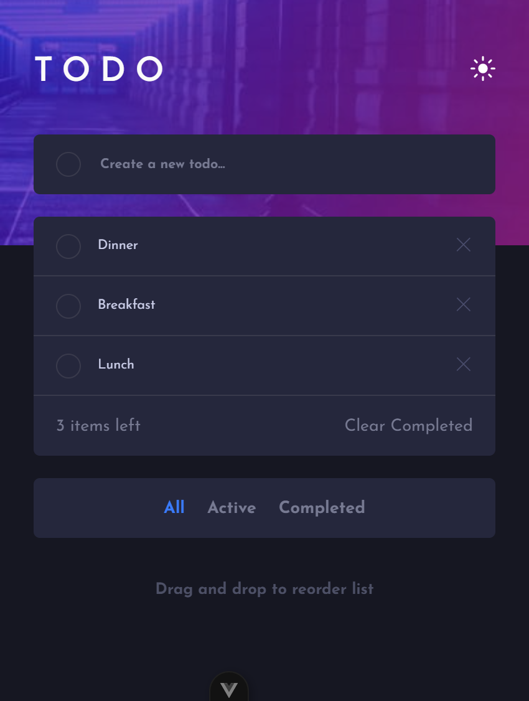
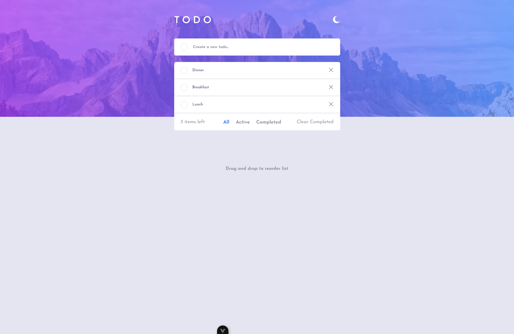

# Frontend Mentor - Todo app solution

This is a solution to the [Todo app challenge on Frontend Mentor](https://www.frontendmentor.io/challenges/todo-app-Su1_KokOW).

## Table of contents

- [Overview](#overview)
  - [The challenge](#the-challenge)
  - [Screenshot](#screenshot)
  - [Links](#links)
- [My process](#my-process)
  - [Built with](#built-with)
  - [What I learned](#what-i-learned)
  - [Continued development](#continued-development)

**Note: Delete this note and update the table of contents based on what sections you keep.**

## Overview

### The challenge

Users should be able to:

- View the optimal layout for the app depending on their device's screen size
- See hover states for all interactive elements on the page
- Add new todos to the list
- Mark todos as complete
- Delete todos from the list
- Filter by all/active/complete todos
- Clear all completed todos
- Toggle light and dark mode
- **Bonus**: Drag and drop to reorder items on the list

### Screenshot

#### Mobile

#### Desktop

### Links

- [Solution URL](https://github.com/jcnevess/todo-app-main)
- [Live Site URL](https://jcnevess.github.io/todo-app-main/)

## My process

### Built with

- Mobile-first workflow
- Vue
- Vite

### What I learned

I learned how to use HTML's drag and drop API and how to implement a light/dark theme switcher using Vue

### Continued development

I think a state management tool like Pinia would help from now onwards.
